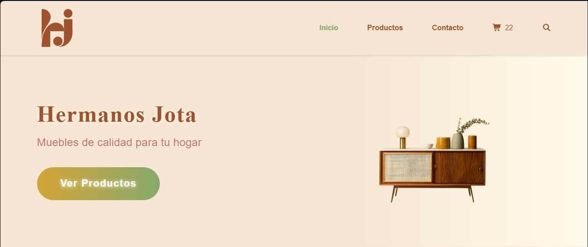
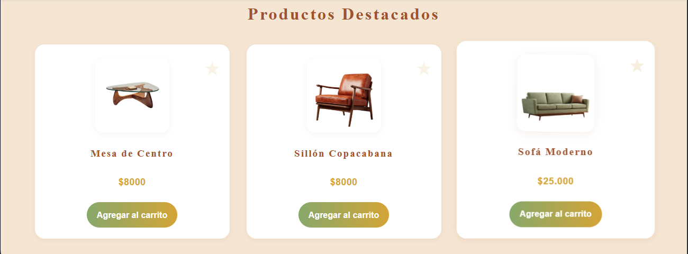
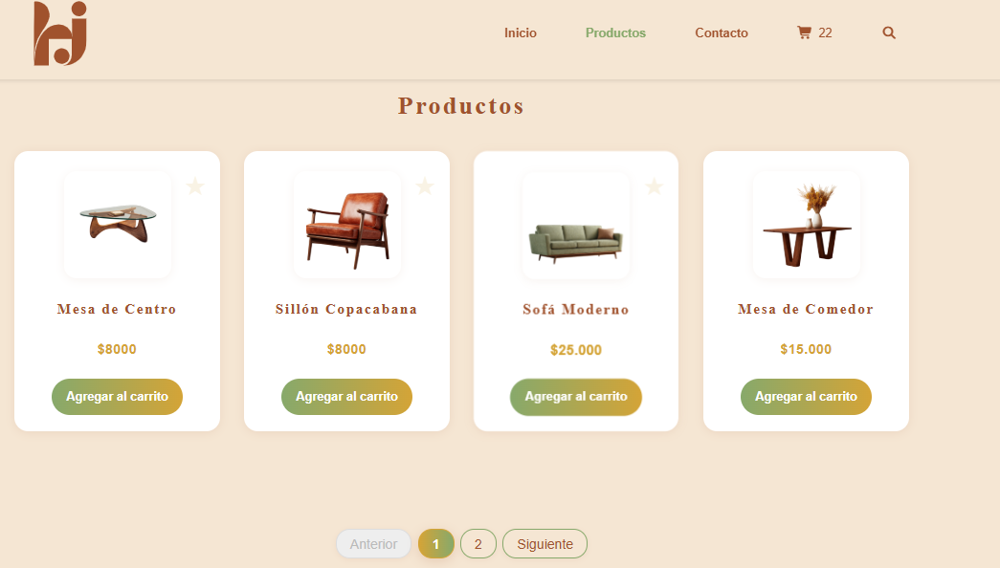
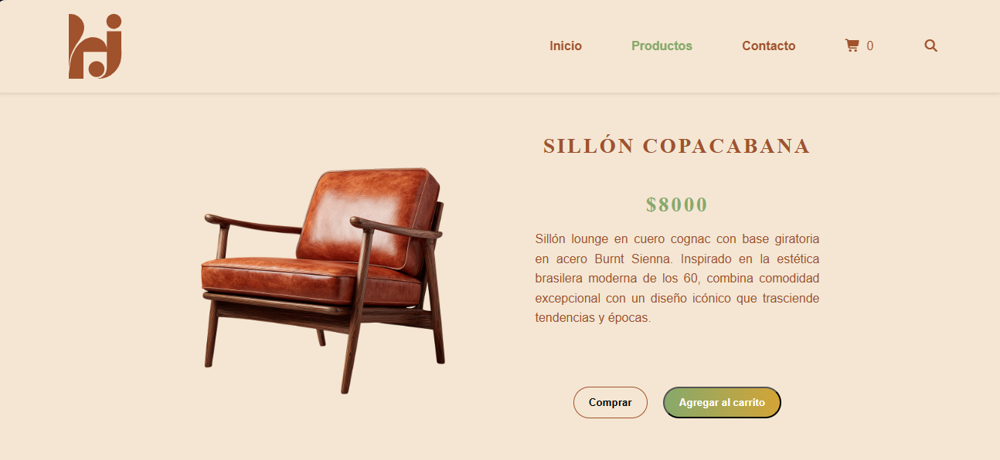
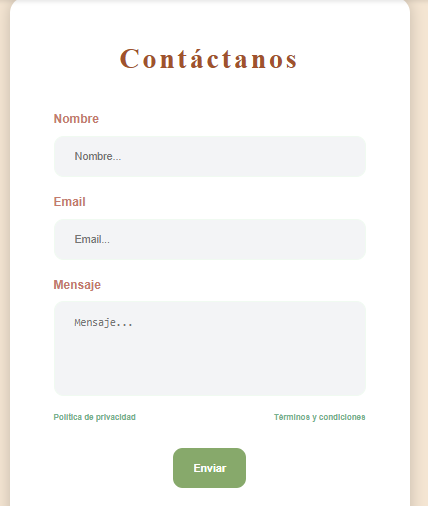

# 🛒 Mueblería Hermanos Jota

¡Bienvenido al repositorio de **Ecommerce Mueblería Hermanos Jota**!  
Este proyecto es una tienda online de muebles, desarrollada con HTML, CSS y JavaScript puro, con funcionalidades modernas y una experiencia de usuario cuidada.

---

## 🚀 Funcionalidades principales

- 🔍 **Buscador global:** Modal de búsqueda en todas las páginas, con filtrado en tiempo real y acceso directo al detalle de producto.
- 🛋️ **Catálogo dinámico:** Renderizado de productos y destacados desde un array, con paginación y filtrado.
- 🛒 **Carrito de compras:** Contador visual, persistencia con localStorage.
- 📄 **Detalle de producto:** Página individual con información ampliada y botones de acción.
- 📬 **Formulario de contacto:** Validación de campos y mensajes de éxito/error.
- 🎨 **Estilos modernos:** Variables CSS, diseño responsive y animaciones sutiles.

---

## 👨‍💻 Integrantes del equipo

| 👤 Nombre           | 💻 Rol         |
|--------------------|-------------|
| Ariel Romero       | Desarrollo  |
| Diego Torres       | Desarrollo  |
| Diego Ramirez      | Desarrollo  |
| Gonzalo Velazquez  | Desarrollo  |

---

## 🛠️ Tecnologías usadas

- [](https://developer.mozilla.org/es/docs/Web/HTML) **HTML5**: Estructura semántica y accesible.
- [](https://developer.mozilla.org/es/docs/Web/CSS) **CSS3**: Variables, Flexbox, Grid, animaciones y diseño responsive.
- [](https://developer.mozilla.org/es/docs/Web/JavaScript) **JavaScript ES6+**: Módulos, manipulación del DOM, lógica de negocio y almacenamiento local.
- [](https://developer.mozilla.org/es/docs/Web/API/Window/localStorage) **LocalStorage**: Persistencia del carrito de compras.
- [](https://www.markdownguide.org/es/) **Markdown**: Documentación y presentación en GitHub.

---

## 📂 Estructura del proyecto

```plaintext
ecommerce-muebleria-hermanosJota/
│
├── index.html
├── productos.html
├── producto.html
├── contacto.html
├── README.md
│
├── assets/
│   └── img/         # Imágenes de productos y logotipo
│   └── screenshots/ # Capturas de pantalla para visualizacion en el README
│
├── css/
│   └── style.css    # Estilos principales
│
└── js/
    ├── app.js                   # Inicialización y orquestación
    ├── busqueda.js              # Lógica del buscador global
    ├── catalogo.js              # Renderizado y paginación de productos
    ├── carrito.js               # Funcionalidad del carrito
    ├── data.js                  # Array y carga de productos
    ├── render.js                # Renderizado de tarjetas y detalles
    └── validacionFormulario.js  # Validación del formulario de contacto
```

---

## 🧑‍💻 Instalación y uso

1. **Clona el repositorio:**
   ```bash
   git clone https://github.com/ByArielRomero/ecommerce-muebleria-hermanosJota.git
   ```
2. **Abre la carpeta en tu editor favorito (VS Code recomendado).**
3. **Abre `index.html` en tu navegador para comenzar a explorar la tienda.**

---

## ✨ ¿Cómo está organizado el código?

- Cada funcionalidad principal está separada en módulos JS para facilitar el mantenimiento.
- Los estilos usan variables CSS y media queries para adaptarse a cualquier dispositivo.
- El buscador y el catálogo funcionan de forma dinámica, sin frameworks externos.

---

## 📸 Capturas de pantalla

| Inicio | Productos Destacados | Catálogo | Detalle de Producto | Formulario | Modal de Búsqueda |
|--------|---------------------|----------|---------------------|------------|-------------------|
|  |  |  |  |  |  |

---

## 📝 Créditos y agradecimientos

- Desarrollado por el equipo de **Hermanos Jota**.
- Imágenes y diseño originales.
- Inspirado en la experiencia de usuario de las mejores tiendas online.

---

## 📬 Contacto

¿Tienes dudas, sugerencias o quieres colaborar?  
Escríbenos a [hermanosjota@ejemplo.com](mailto:hermanosjota@ejemplo.com)

---

## 🏷️ Licencia

Este proyecto es de uso educativo y personal.  
Puedes adaptarlo y mejorarlo libremente.

---

### ¡Gracias por visitar nuestra tienda! 🪑✨
